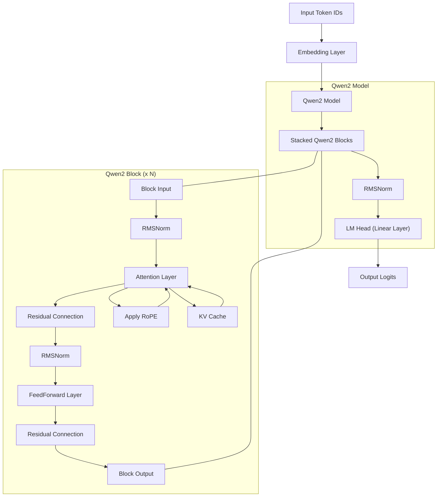

# Qwen2-PyTorch

This repository contains a minimal PyTorch implementation of the Qwen2 language model, designed for clarity and ease of understanding. It includes the core components of the Qwen2 architecture, such as RMSNorm, Rotary Position Embeddings (RoPE), Grouped Query Attention (GQA) with sliding window, and a FeedForward network.

## How to Run `main.py`

The `main.py` script demonstrates how to load a pre-trained Qwen2 model and generate text based on a hardcoded prompt.

To run the program, simply execute the following command in your terminal:

```bash
python main.py
```

The script will:
-   Automatically detect and use a CUDA-enabled GPU if available; otherwise, it will fall back to the CPU.
-   Load the `Qwen/Qwen2-0.5B-Instruct` model from `./hf/model.safetensors`.
-   Load the tokenizer from the local directory (`./hf/tokenizer.json`).
-   Process a hardcoded user message: "What is the difference between a list and a tuple in Python?".
-   Generate a response using the model with `max_new_tokens=512`, `temperature=0.7`, and `top_p=0.9`.

## Qwen2 Model Architecture

The Qwen2 model implemented here is composed of several key components:

-   **`RMSNorm`**: A root mean square normalization layer used throughout the network.
-   **Rotary Position Embedding (RoPE)**: Position embeddings applied directly to the query and key tensors in the attention mechanism.
-   **`Attention`**: Implements the multi-head attention mechanism, incorporating:
    -   Grouped Query Attention (GQA) for efficiency.
    -   Sliding Window Attention, which limits the attention span to a fixed window size for faster inference.
    -   KV Caching to optimize sequential token generation.
-   **`FeedForward`**: A standard feed-forward network with a SiLU activation function.
-   **`Qwen2Block`**: The fundamental building block of the model. Each block consists of:
    -   An `Attention` sub-layer, preceded by `RMSNorm`.
    -   A `FeedForward` sub-layer, also preceded by `RMSNorm`.
    -   Residual connections around both the attention and feed-forward sub-layers.
-   **`Qwen2` (Main Model)**: The complete model comprises:
    -   `embed_tokens`: An embedding layer to convert input token IDs into dense vectors.
    -   `layers`: A stack of `num_hidden_layers` `Qwen2Block`s.
    -   `norm`: A final `RMSNorm` layer applied to the output of the stacked blocks.
    -   `lm_head`: A linear layer that projects the hidden states back to the vocabulary size, used for predicting the next token.

## Model Architecture Visualization (Mermaid)


